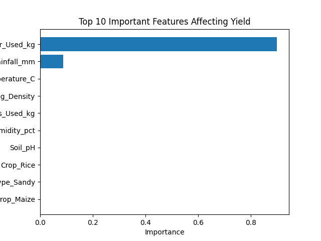

#  Crop Yield Prediction & AI Advisory System

##  Project Overview
This project uses **Machine Learning** to predict agricultural yields based on environmental factors. To add value for the end-user (farmers), I integrated **Generative AI** to provide natural-language recommendations based on the data.

##  Key Features
- **Predictive Modeling:** Uses Random Forest Regression for high-accuracy yield estimation.
- **Automated Preprocessing:** Handles categorical data and scaling automatically.
- **GenAI Advisory:** Connects to the **Gemini Pro API** to generate human-readable farming advice based on model results.

##  Technical Stack
- **Languages:** Python
- **ML Libraries:** Scikit-learn, Pandas, NumPy
- **Visualization:** Matplotlib, Seaborn
- **LLM Integration:** Google Generative AI (Gemini Pro)

##  Results
The model identifies the most critical factors affecting yield, as seen below:

